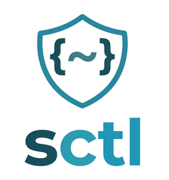
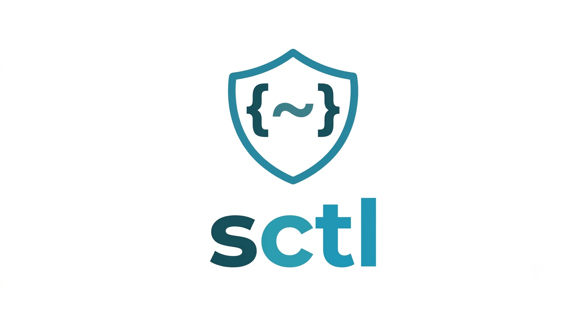
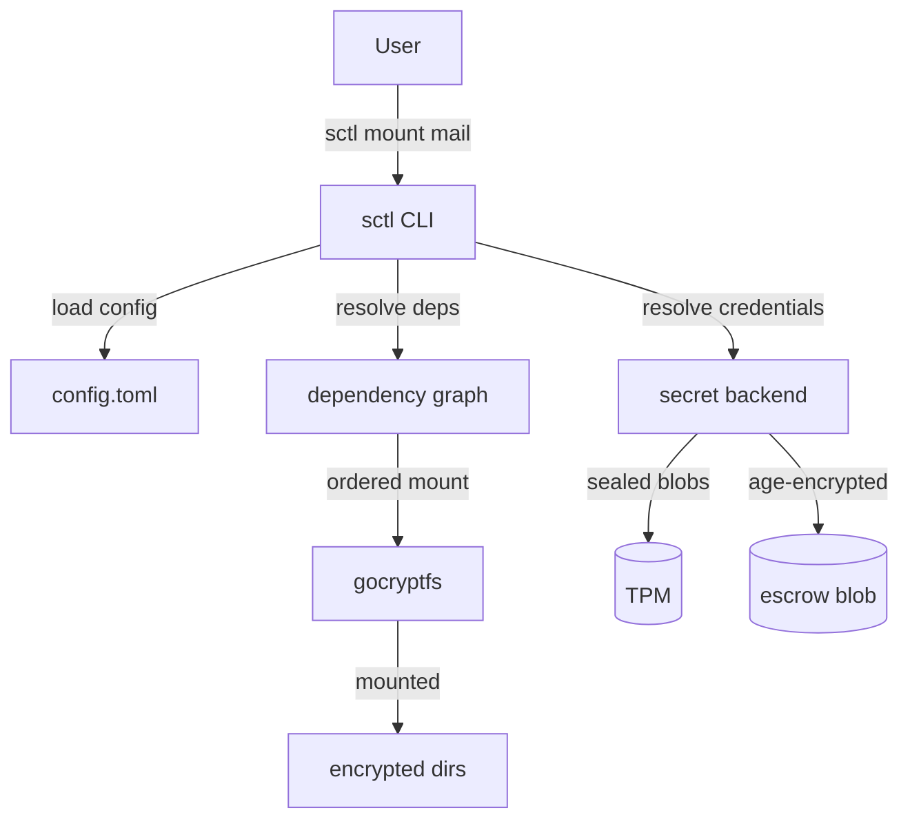

<p align="center">
  
</p>

# sctl

[](https://github.com/aldoshkineg/sctl/actions/workflows/ci.yml)
[](https://github.com/aldoshkineg/sctl)
[](https://www.rust-lang.org)

<p align="center">
  
</p>

**sctl** makes encrypted directories feel transparent. Keep `~/.ssh`, `~/.gnupg`, password stores, shell environment files, mail archives, or any other sensitive data encrypted at rest while mounting them automatically when needed. Credentials are securely sealed to your machine's TPM (or an encrypted escrow), so one unlock is all it takes. Dependency resolution, idle unmounting, gpg-agent integration, and other quality-of-life features are built in.

## Table of Contents

- [Why sctl?](#why-sctl)
- [Features](#features)
- [Architecture](#architecture)
- [Typical workflow](#typical-workflow)
- [Installation](#installation)
- [Quick Start](#quick-start)
- [Commands](#commands)
- [Configuration](#configuration)
- [Security](#security)
- [Documentation](#documentation)
- [Environment Variables](#environment-variables)
- [License](#license)

## Why sctl?

Managing multiple encrypted directories means mounting them by hand
and remembering every password. `sctl` eliminates that burden entirely.

| | Without sctl | With sctl |
|---|---|---|
| Mount volumes | Manually, in order | `sctl mount mail` — deps resolve automatically |
| Credentials | Remember each one | Stored once in TPM or escrow |
| Dependency order | Figure it out yourself | Declared in config, enforced at runtime |
| Unmount | Manual, fragile | Automatically unmounts dependencies that are no longer needed |
| Idle cleanup | None | Auto-unmount after configurable timeout |
| gpg-agent integration | Restart and re-enter passphrase | Preloaded from backend automatically |
| Plaintext on disk | Often required | None — secrets are zeroized in memory |
| Recovery if hardware fails | Manual backups | Encrypted escrow blob, any machine |
| AI agents / shell env | Secrets exposed via plaintext `.env` and `zshenv` | Encrypted at rest, mounted only when needed, zeroized on unmount |

## Features

### Mount lifecycle

- **Dependency-aware mounting** — mount a secret and all its dependencies come up in the right order.
- **Smart cascade unmount** — automatically unmounts dependencies that are no longer needed; mounted dependents are protected from accidental removal.
- **Idle auto-unmount** — per-secret or global timeout triggers automatic cleanup.
- **Busy filesystem handling** — configurable `auto_kill` list silently terminates known processes; `--force` handles the rest.
- **Watch daemon** — background process force-unmounts secrets stuck busy past a configurable threshold.

### Security

- **No plaintext keyfiles** — credentials are passed via a temporary `0600` passfile, never visible in `ps`.
- **Only ciphertext on disk** — TPM blobs + the age-encrypted escrow blob are the only files written.
- **TPM binding** — secrets sealed to the hardware TPM; escrow provides recovery portability.
- **Escrow recovery** — encrypted copy of all credentials, recoverable from any machine.
- **Atomic updates** — both backends are derived from one in-memory map and written atomically (tmp + rename, `0600`), so TPM and escrow can never diverge.
- **Zeroized memory** — all secret bytes are cleared on drop.
- **Advisory file locking** — concurrent invocations are safe, second `sctl` touching the same secret fails fast.

### User experience

- **One configuration file** — TOML, human-readable.
- **Colored status table** — aligned output with mounted secrets highlighted.
- **Shell completions** — `sctl completions zsh|bash|fish|powershell`.
- **Dry-run mode** — preview mount/unmount plans without doing anything.
- **Toggle command** — mount if down, unmount if up — perfect for keybindings.

## Architecture



`sctl` keeps a single in-memory **secret map** (gocryptfs shared password `G` + per-gpg-key passphrases). That map is serialized once, wrapped with a Data Encryption Key (DEK), and sealed into both the TPM and an encrypted escrow blob. On mount, `sctl` retrieves the DEK from the TPM, decrypts the map, and uses it — all zeroized when done.

## Typical workflow

```bash
$ sctl mount mail

✓ gpg
✓ pass
✓ mail

$ neomutt

$ sctl umount mail

✓ mail
✓ pass
✓ gpg
```

## Installation

### From GitHub Releases

Pre-built binaries are available at [https://github.com/aldoshkineg/sctl/releases](https://github.com/aldoshkineg/sctl/releases).

```sh
# Linux x86_64 (static musl build — no runtime dependencies
# beyond gocryptfs and fusermount3)
VERSION=v0.9.14
curl -LJO https://github.com/aldoshkineg/sctl/releases/download/${VERSION}/sctl-${VERSION}-linux-x86_64-static.tar.gz
tar xzf sctl-${VERSION}-linux-x86_64-static.tar.gz
sudo install -m755 sctl-${VERSION}-linux-x86_64-static/sctl /usr/local/bin/
```

### From source

```sh
make install
# or manually:
cargo build --release && install -m755 target/release/sctl ~/.local/bin/sctl
```

Requires `gocryptfs`, `fusermount3`, and `fuser` at runtime; `notify-send` (`--notify`) is optional.

## Quick Start

1. **Copy the example config** and edit your secrets:

   ```sh
   cp config.example.toml ~/.config/sctl/config.toml
   # edit ~/.config/sctl/config.toml
   ```

2. **Create encrypted containers** and migrate existing data:

   ```sh
   sctl init gpg ssh mail
   ```

3. **Enroll credentials** into the backend (one time per machine):

   ```sh
   sctl install
   ```

4. **Mount everything** — credentials resolved automatically:

   ```sh
   sctl mount all
   ```

5. **Verify** the backend is healthy:

   ```sh
   sctl check
   ```

6. **View status** — mounted secrets are highlighted, idle timers visible:

   ```sh
   sctl status
   ```

## Commands

| Command | Description |
|---------|-------------|
| `sctl init <name>…` | Create encrypted container(s), migrate existing data |
| `sctl install` | Enroll all credentials into the backend |
| `sctl mount <name>…` | Mount secret(s); dependencies resolved first |
| `sctl status` | Colored table of mount states and idle timers |
| `sctl toggle <name>…` | Mount if down, unmount if up |
| `sctl umount <name>…` | Unmount with smart dependency cascade |
| `sctl check` | Validate config, backends, permissions, dependencies |
| `sctl recovery [filter]` | Decrypt the escrow blob (no TPM needed) |
| `sctl watch [--once]` | Force-unmount secrets stuck busy past threshold |
| `sctl completions <shell>` | Generate shell completions |
| `sctl version` | Print version |

## Configuration

Config lives at `~/.config/sctl/config.toml`. See [`config.example.toml`](config.example.toml) for the full reference.

Minimal example:

```toml
[settings]
default_idle = "15m"
secret_backend = "tpm"

[secrets.gpg]
path = ".gnupg"
gpg = true
gpg_preset = true

[secrets.mail]
path = ".local/share/mail"
depends = ["gpg", "pass"]
idle = "30m"
auto_kill = ["lf", "nnn"]
```

For the full configuration reference — secret backend details, DEK model, first-run walkthrough, gpg preloading, and `zshenv` — see [docs/configuration.md](docs/configuration.md).

## Security

- ✅ No plaintext keyfiles — credentials are passed via a temporary `0600` passfile, never exposed in `ps`
- ✅ Only ciphertext on disk — TPM blobs and the age-encrypted escrow blob are the only files written
- ✅ TPM binding — secrets are sealed to the hardware TPM; escrow provides recovery portability
- ✅ Escrow recovery — encrypted copy of all credentials, usable from any machine
- ✅ Atomic updates — both backends derive from one in-memory map, written atomically (tmp + rename, `0600`)
- ✅ Zeroized memory — all secret bytes are cleared on drop
- ✅ Advisory file locking — concurrent invocations are safe, second `sctl` touching the same secret fails fast

For a deeper dive into the encryption model, threat analysis, and known limitations, see [docs/security.md](docs/security.md).

## Documentation

| Topic | Description |
|-------|-------------|
| [Architecture](docs/configuration.md#architecture) | DEK model, data flow, wrapping layers |
| [Configuration](docs/configuration.md) | Full config reference, DEK model, first-run guide, gpg preloading |
| [Security](docs/security.md) | Encryption architecture, threat model, backend design |
| [GPG integration](docs/gpg.md) | Passphrase preloading, gpg-agent integration, preset modes |
| [Recovery](docs/recovery.md) | Escrow decryption, cross-machine recovery, prefix filtering |
| [Busy handling](docs/busy.md) | auto_kill policy, kill_busy watcher, mount/unmount behavior |

## Environment Variables

| Variable | Description |
|----------|-------------|
| `SCTL_CONFIG_DIR` | Config directory (default: `~/.config/sctl`) |
| `SCTL_CONFIG` | Override config path |
| `SCTL_STATE_DIR` | State directory for TPM blobs |
| `SCTL_ENC_ROOT` | Encryption root directory |
| `SCTL_DEFAULT_IDLE` | Global default idle timeout |
| `SCTL_IDLE` | Per-invocation idle timeout |
| `SCTL_NO_IDLE` | Disable idle auto-unmount |
| `SCTL_MASTER_PASS` | Master passphrase for escrow (non-interactive) |
| `CRYPT_PASS` | Non-interactive gocryptfs password |
| `SCTL_STRAY_DIR` | Stray directory for orphaned mounts |
| `SCTL_COLOR` | Color output: `always` or `never` |
| `NO_COLOR` | Disable colored output |

## License

Licensed under either of MIT or Apache-2.0 at your option.